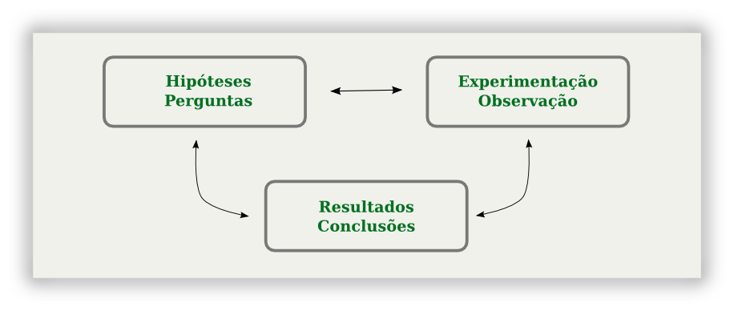
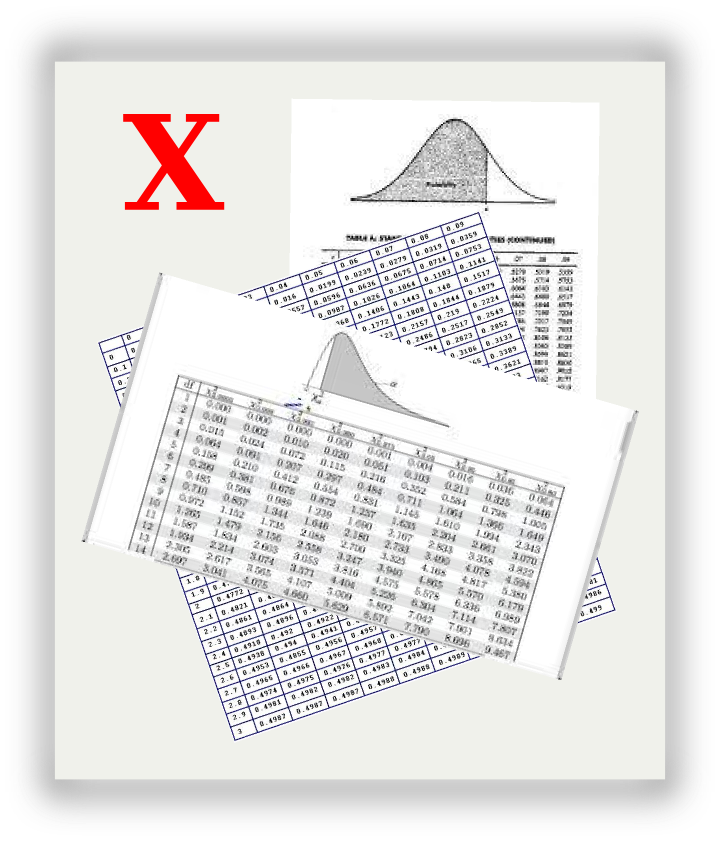
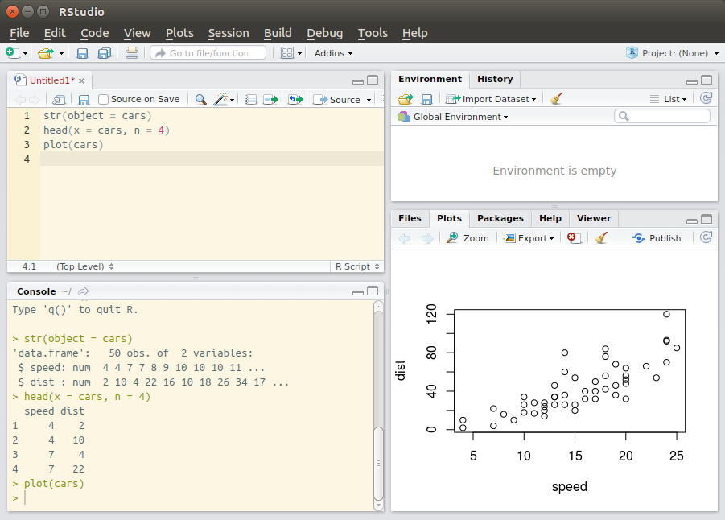

```{r setup, include=FALSE}

library(knitr)
opts_chunk$set(
    warning = FALSE,
    message = FALSE,
    echo = FALSE,
    fig.align = "center")

library(ggplot2)
library(grid)
library(gridExtra)

```

## ## {data-background=#383D3D}

<h1 class="slide-title">Estatística</h1>

## Método Científico ##

```{r, out.width = "100%"}



```

_"Without data, you're just another person with an opinion."_\
-- W. Edwards Deming


## Estatística ##

A ciência que obtêm informações a partir de dados, quantificando a
incerteza inerente ao processo de coleta.

A Estatística é uma ciência multidisciplinar e atua nas diferentes fases
de uma pesquisa:

 * Planejamento da coleta de dados;
 * Amostragem;
 * Análise Exploratória;
 * Inferência Estatística;

## Recursos computacionais ##

<div id="col-right">

<div class="fragment" data-fragment-index="1">

```{r, out.width = "90%"}



```

</div>
</div>

<div id="col-left">

<div class="fragment" data-fragment-index="2">

Softwares:

 * **R**;
 * SAS;
 * Minitab;
 * SPSS;
 * Stata;

</div>
</div>

## ## {data-background=#383D3D}

<h1 class="slide-title">O software R</h1>

## Software livre ##

Além de produto gratuito.

 * Liberdade para executar/usar;
 * Liberdade para copiar;
 * Liberdade para distribuir;
 * Liberdade para estudar;
 * Liberdade para modificar;
 * Liberdade para melhorar.

## Linguagem de programação ##

_There is R. There is no if. Only how._\
-- Simon Blomberg

```{r, echo=TRUE}

## Medidas resumo de todas as variáveis
dados <- mtcars
do.call(rbind, lapply(dados, summary))

```

## Comunidade ativa ##

Relatados <font color="red">158 livros</font> com aplicações em R.

```{r, out.width = "80%"}

knitr::include_graphics("images/r-books.png")

```

## Comunidade ativa ##

Atualmente (29/08/2016) <font color="red">9.037 pacotes</font> no CRAN.

```{r, out.width = "80%"}

knitr::include_graphics("images/packs.png")

```


## Comunidade ativa ##

<font color="red">580 blogs</font> vínculados ao R-bloggers.

```{r, out.width = "80%"}


```


## Visualização de dados ##

```{r}

g1 <- ggplot(iris, aes(x = Sepal.Length, y = Sepal.Width,
                       color = Species)) +
    geom_point()

g2 <- ggplot(mtcars, aes(x = as.factor(carb), y = mpg)) +
    geom_boxplot()

g3 <- ggplot(cars, aes(x = speed, y = dist)) +
    geom_point() +
    geom_smooth()

mtcars$cyl <- as.factor(mtcars$cyl)
g4 <- ggplot(mtcars, aes(x = disp, y = mpg, color = cyl)) +
    geom_point() +
    geom_smooth(method = "lm")

grid.arrange(g1, g2, g3, g4, ncol = 2)

```

## Pesquisa reproduzível ##

<div id="col-left">

```
---
title: Meu título
author: Meu nome
output: pdf_document
---

# Meu primeiro trabalho

Meu primeiro trabalho reproduzível.

 * Aprender R
 * Elaborar relatórios

'''{r}
plot(cars)
'''

```

</div>

<div id="col-right">

```{r, out.width="90%"}

knitr::include_graphics("images/rmd1.png")

```

</div>

## ## {data-background=#383D3D}

<h1 class="slide-title">Como começar</h1>

## Download ##

```{r, out.width="90%"}


```

## Editores ##

O R é uma linguagem de programação interpretada, ou seja, comando
escrito é comando executado. Use bons editores para montar seu script,
por exemplo:

 * Emacs;
 * Vim;
 * Tinn-R;
 * **RStudio**;
 * ...

## RStudio ##

```{r, out.width="90%"}

knitr::include_graphics("images/rstudio1.png")

```

## RStudio ##

```{r, out.width="90%"}



```

## Tutoriais ##


<div id="col-right">
Tutoriais interativos:

 * [**TryR**][tryr]
 * [**Datacamp swirl**][datacamp]
</div>

<div id="col-left">
Materiais não interativos:

 * [Apostila do LEG UFPR](http://www.leg.ufpr.br/~paulojus/embrapa/Rembrapa/)
 * [Apostila UFSM](http://www.uft.edu.br/engambiental/prof/catalunha/arquivos/r/r_bruno.pdf)
</div>

<!--------------------------------------------- -->
[tryr]: http://tryr.codeschool.com/
[datacamp]: https://www.datacamp.com/community/open-courses/r-programming-with-swirl
