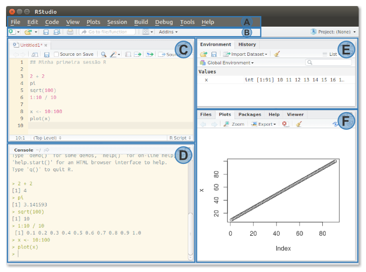

***

# O software R #

Como já discutido na [aula motivacional](./rcourse00.html) para o curso,
R é uma linguagem e ambiente para computação estatística e gráfica,
disponível sob os termos da licença GNU de software livre. Criada em
1996 por Robert Gentleman and Ross Ihaka, o R pode ser considerado um
diferente implementação de S, a linguagem comercial desenvolvida pela
Bell Laboratories, que antecede o R.

Pode-se destacar diversos tópicos que fazem do R a excelência em
software para manipulação de dados, análise estatística e visualização
gráfica, porém listamos apenas alguns abaixo:

 * Eficaz em manipulação e armazenamento de dados;
 * Grande conjunto de recursos para calculos vetoriais e matriciais;
 * Diversas ferramentas para análise de dados;
 * Ampla suíte de funções para visualização de dados, que podem ser
   exportados para diversos formatos;
 * Linguagem de programação simples e eficaz (loops, condicionais,
   funções recursivas, etc.); e
 * Simples construção e disponibilização de pacotes com funções
   específicas, via CRAN (Comprehensive R Archive Network)

Explore o sítio do projeto R e o espelho c3sl UFPR da rede global de
arquivos R.

 * **Projeto R** (<https://www.r-project.org/>);
 * **Repositório R** (<http://cran-r.c3sl.ufpr.br/>)

Outros sites interessantes sobre iniciativas com o R são:

 * **ROpenSci** - R Open Science (<https://ropensci.org/>);
 * **RConsortium** - grupo para prestar suporte a Comunidade R
 (<https://www.r-consortium.org/>);
 * **MRAN** - Microsoft R Application Network
 (<https://mran.revolutionanalytics.com/>)
 * **FOAS** - Foundation for Open Access Statistics
   (<http://www.foastat.org/>)

# RStudio IDE #

O ambiente de desenvilvimento integrado - IDE (Intergrated DEvelopment
Environment) RStudio é um produto da empresa RStudio
(<https://www.rstudio.com/>) que, como o próprio nome diz, é um ambiente
de desenvolvimento integrado de códigos R. O RStudio IDE permite o
desenvolvimento de códigos de outras linguagens também, porém diversas
funcionalidade são otimizadas para R.

O download do RStudio IDE pode ser feito pelo endereço
<https://www.rstudio.com/products/rstudio/download/> com versões
disponíveis para diversas plataformas (Linux, Windows e MAC).

No curso utilizaremos essencialmente o RStudio por facilidade, mas
existem outros editores e o usuário de R tem a liberdade para
escolher o que mais lhe agrada. Para a escolha de um editor destacamos
algumas ferramentas que são indispensáveis para um bom desenvolvimento
de programação R:

 * Destaque de código;
 * Destaque de marcadores de ambiente (parênteses, chaves e colchetes);
 * Identação automática;
 * Auto-completar de função e objetos; e
 * Interação para edição de documentos híbridos (R+Markdown e R+LaTeX).


## Elementos da interface ##

Ao instalar o RStudio, temos a interface do programa com a seguinte
estrutura descrita abaixo:



em que:

(A): Barra de navegação
: Contém todas as funcionalidades do RStudio IDE desde criar, abrir
arquivos e ferramentas para edição de códigos (desfazer, refazer, etc.)
além de inserir seções até as configurações globais e documentos de
ajuda sobre o programa.

(B): Barra de acesso rápido
: Esses são apenas atalhos rápidos para algumas rotinas mais utilizadas
pelos usuários como criar, abrir, salvar arquivos, por exemplo.

(C): Edição de scripts
: Este é o ambiente no qual escrevemos nossos códigos. Todo o código de
uma análise é escrito nesse campo. Como já dito o RStudio não é um
editor somente de R, arquivos R e de outras linguagens também podem ser
editados aqui. Note que vários arquivos podem ser abertos
simultaneamente, eles ficarão dispostos em abas nesse painel.

(D): Console R
: Nesse campo temos o R propriamente dito, o chamamos de console R. Tudo
que for escrito aqui será automaticamente interpretado. O que fazemos é
enviar os códigos escritos em (C) para cá, com o atalho de teclado
`Crtl+R`, ou atalho da interface.

(E): Visualização de objetos e códigos elaborados
: Esse painel é composto por duas abas. A primeira, *Environment*, exibe
as variáveis de ambiente criadas durante a sessão e a segunda, *History*
exibe toda a sequência de códigos interpretada pelo console na sessão.

(F): Visualização gráficos, arquivos, pacotes e ajuda
: Neste painel têm-se diversas abas listadas abaixo:
  * *Files*: explorador de arquivos do R;
  * *Plots*: visualização de gráficos interpretados pelo console (D);
  * *Packages*: lista de pacotes instalados e atalho para instalação de
    pacotes;
  * *Help*: lista de ajuda para funções do R e atalho para suportes
    online do RStudio; e
  * *Viewer*: Visualizador de outputs web, como páginas html,
    aplicativos Shiny, apresentações Rpres ou documentos pdf.

Aqui foram listados, brevemente, alguns aspectos da interface, todavia
seja curioso e explore as demais funcionalidades do RStudio IDE.

## Alguns atalhos ##

Toda a edição de scripts realizada no RStudio IDE pode ser otimizada
utilizando atalhos do teclado para algumas rotinas. Quanto menos você
precisar do mouse mais rápida e eficientemente você programa.

Todos os atalhos do RStudio podem ser visualizados no menu de navegação
`(A)->Tools->Keyboard Shortcuts Help`, ou ainda pelo atalho
`Alt+Shift+K`. Os atalhos indispensáveis são:

 * `Alt+-`: Sinal de atribuir (`<-`);
 * `Ctrl+r`: Executar linha/região do script;
 * `Ctrl+i`: Indentar região; e
 * `Ctrl+Shift+C`: Comentar linha/região.

# Aritmética e objetos #

## Operações aritméticas ##

O R pode ser usado como calculadora, todas as operações matemáticas
básicas estão disponíveis em R.

```{r}

2 + 2      # Soma
4 - 2      # Subtração
12 * 42    # Multiplicação
54 / 30    # Divisão
5^3        # Potência
5**3        # Potência

```

E claro, expressões numéricas também podem ser feitas. Respeita-se a
hierárquia matemática primeiro potência < multiplicação < soma, porém
essa ordenação pode ser contralada por parênteses.

```{r}

2 + 2 * 4 + 4/2          # Hierarquia matemática
2 + 2 * (4 + 4)/2        # Primeiro a soma dos 4's
(2 + 2) * 4 + 4/2        # Primeiro a soma dos 2's
(2 + 2) * (4 + 4)/2      # Primeiro as somas

((2 + 2) * (4 + 4)/2)/2  # Vários parenteses

```

Operações matematicamente incorretas ou não exatas também tem seu valor
representado em R.

```{r}

0/0       # Impossível, não existe (Not a Number - NaN)
1/0       # Indefinido, positivo de infinito (Inf)
-1/0      # Indefinido, negativo de infinito (-Inf)
NA        # Valor não disponível (Not Available - NA)

```

## Operações lógicas ##

As operações descritas acima são operações matemáticas simples, porém em
muitas situações deseja-se realizar testes lógicos, e.g. o peso do
paciente é maior de 60Kg, abaixo exemplificamos como realizar esses
testes.

```{r}

2 == 4            # Igualdade
2 > 4             # Desigualdade (maior)
2 < 4             # Desigualdade (menor)
2 >= 4            # Desigualdade (maior igual)
2 <= 4            # Desigualdade (menor igual)

```

E claro expressões lógicas também podem ser realizadas.

```{r}

(2 + 2) >= 4
(2 + 2)/2 < 4

```

Outro operador lógico muito útil é o de negação `!`, esse operador
inverte um resultado lógico

```{r}

!2 == 4
!2 > 4
!2 < 4

```

## Criando objetos ##

O R é uma linguagem orientada a objetos, ou seja, objetos (valores,
vetores, matrizes, listas, funções, etc.) são armazenadas em espaços de
memória de seu computador, para posteriormente serem
utilizados. Atribui-se algo a um objeto pelo operador `<-`.

```{r}

x <- 2       # Atribuindo o valor 2 ao objeto x
y <- 4       # Atribuindo o valor 2 ao objeto y
x + y

z <- x * y   # Atribuindo ao z o valor da multiplicação de x por y
z

a <- 2 == 2  # Valores lógicos também podem ser armazenados em objetos
a

```

Isso mesmo, em R a atribuição é realizada de forma muito simples!

# Tipos de objetos #

O R tem uma gama muito grande de classes de objetos. Todo objeto possui
uma classe que o define. Usuários de R devem conhecer bem as classes de
seus objetos para coordenar funções apropriadas a eles.

Use e abuse das funções `class()`, que exibe a classe do objeto e
`str()`, que mostra sua estrutura.

```{r}

# Verificando a estrutura dos objetos criados
str(x)
class(x)

str(a)
class(a)

# Classes comuns no R
"string"; class("string")  # character
100L; class(100L)          # integer
100; class(100)            # numeric
TRUE; class(TRUE)          # logical

```

## Vetores ##

O R é uma linguagem vetorial, ou seja, operações com objetos dessa
classe são realizadas diretamento, sem a necessidade de loops (`for`,
por exemplo).

A criação de vetores é feita, em geral, com a função `c()` de combinar
valores em vetores ou listas.

```{r}

x <- c(2, 4, 6, 8, 10, 12)
x

# O que é x?
str(x)
class(x)

```

Vetores também podem ser criados com as funções `rep()` e `seq()`, que
fazem repetições e sequências respectivamente e com o operador `:` que
faz a sequência de incremento 1 entre dois valores.

```{r}

y <- 1:6
y

```

E claro, as operações com os vetores.

```{r}

x * 2
x / y

```

As operações lógicas seguem da mesma forma, todavia podemos introduzir
um novo operador o `%in%`, esse é o operador "pertence".

```{r}

x == y          # x é igual a y, elemento a elemento?
2 %in% y        # 2 pertence ao conjunto de y?
x %in% y        # x pertence ao conjunto y, elemento a elemento?

```

E a seleção de valores do vetor é feita com os operadores `[]`.

```{r}

y[1]           # Seleciona o 1º elemento
y[c(1, 3)]     # Seleciona o 1º e quinto elementos
y[y > 3]       # Seleciona apenas os y que são maiores que 3
y[x %in% y]    # Seleciona apenas os y que satizfazem x %in% y

```

## Matrizes ##

Matrizes representam um conjunto de valores organizados em linhas e
colunas. Matrizes são criadas com a função `matrix()`, onde informamos
os valores que faram parte da matriz e a dimensão dessa matriz, os
argumentos da função são (não se preocupe com todos os argumentos,
alguns tem um valor padrão! Discutiremos funções adiante).

```{r}

# Argumentos da função matrix
# help(matrix)
args("matrix")

```

Agora criando matrizes

```{r}

# Matrizes com 10 elementos de dimensão 2x5
matrix(data = 1:10, nrow = 2, ncol = 5)
matrix(data = 1:10, nrow = 2, ncol = 5, byrow = TRUE)

# Matrizes com 18 elementos de dimensão 3x6
matrix(data = 1:18, nrow = 3)
matrix(data = 1:18, nrow = 3, byrow = TRUE)

```

A seleção de elementos da matriz também é feita com o operador `[]`,
porém agora temos duas dimensões para seleção, as linhas e as colunas.

```{r}

# Matrizes com 18 elementos de dimensão 3x6
ma <- matrix(data = 1:18, nrow = 3, byrow = TRUE)
ma

# Estrutura do objeto
str(ma)

ma[1, 3]       # Elemento da linha 1 e coluna 3
ma[, 3]        # Elementos da coluna 3 (é um vetor)
ma[1, ]        # Elementos da linha 1 (é um vetor)

```

O foco deste curso não será na computação. Portanto não apresentaremos
as operações com matrizes mas saiba que existem, adição e multiplicação de
matrizes, transposta, inversa, produto interno, traço, entre outras
operações podem facilmente realizadas com funções nativas do R.

## Data frames ##

`data.frames` são a classe de objetos que mais utilizamos. Eles
são a representação dos nossos dados em R. Podemos criar `data.frames`
com a função `data.frame`. Assim como nas matrizes, veja seus argumentos
e consulte o *help* da função.

```{r}

# Argumentos da função data.frame
# help(data.frame)
args("data.frame")

```


```{r}

# Um exemplo de data.frame
data.frame(x = 1:6, y = 11:16, z = rep(0:1, 3))

# Construindo data.frames com objetos criados
data.frame(x = x, y = y, z = x * y, w = x %in% y)

```

Agora que já sabemos como criar `data.frames`, criaremos um `data.frame`
fictício para exemplificar a seleção de elementos de um objeto dessa
classe, que pode realizada com os operadores `$` ou ainda `[]`.

```{r}

# Criando dados fictícios de pacientes
da <- data.frame(
    nome = c("João", "Maria", "José", "Pedro", "Ana", "Carla", "Paulo"),
    idade = c(30, 22, 21, 40, 32, 18, 24),
    sexo = c("M", "F", "M", "M", "F", "F", "M"),
    imc = c(30.98, 37, 42.29, 27.59, 21.18, 25.23, 8.81),
    hdl = c(68.89, 70.25, 15.59, 49.24, 50.79, 45.22, 56.65)
)
da

# Estrutura dos dados
str(da)


da[2, ]         # Selecionando os dados da Maria
da[, 2]         # Selecionando as idades
da[, "idade"]   # Selecionando as idades
da$idade        # Selecionando as idades

da[, c("imc", "hdl")]   # Selecionando as variáveis imc e hdl
da[2, c("imc", "hdl")]   # Selecionando as variáveis imc e hdl da Maria

```

Note que a seleção de elementos é bastante similar a seleção no caso das
matrizes. A principal diferença entre matrizes e `data.frames` no R é
que `data.frames` permitem que cada coluna possua um vetores com
elementos de classes diferentes (fatores, numéricos, inteiros,
caracteres, lógicos, etc.), isso não é possível em matrizes.

## Listas ##

As listas são os objetos mais flexíveis em R, elas permitem armazenar
diversos formatos em um único objeto. Listas são criadas com a função
`list()`.

```{r}

# Lista de vetores
list(a = 1:6, b = c("Olá", "mundo"), c = c(TRUE, FALSE, FALSE))

# Lista com objetos de diferentes tipos
la <- list(ma = ma, da = da, x = x, y = y)
la

# Estrutura da lista
str(la)

```

Note que `la` é uma lista com `r length(la)` elementos, para
selecionarmos elementos dessa lista usamos o operador `[[]]`.

```{r}

la[[1]]           # Primeiro elemento da lista
la[["da"]]        # Elemento 'da' da lista
la[c("x", "y")]   # Sub-lista com x e y

# Agora para selecionar as idades do elemento 'da' da lista 'la'
la[["da"]][, "idade"]

# E a segunda linha do elemento 'ma' da lista 'la'
la[["ma"]][2, ]

```

## Funções ##

Uma das grandes vantagens em linguagens de programação é que podemos
criar nossas próprias funções e com isso controladas toda a rotina de
análise. Em R não pe diferente, podemos criar nossas próprias função,
bem como utilizar as que já existem, como fizemos até agora.

Funções em R são construídas com a estrutura de programação
`function`. Abaixo exemplificamos como se cria uma função em R.

```{r}

# Função que soma 2 ao elemento
fx <- function(a) {
    (a + 2)
}

# O que é fx?
class(fx)

# Usando a minha função
fx(2)
fx(5)
# fx("a") Erro

# Função com mais de um argumento
fx2 <- function(a, b) {
    a + b
}

fx2(5, 4)
fx2(3, 2)
# fx2(3) Erro

# Função com argumento padrão (default)
fx2 <- function(a, b = 2) {
    a + b
}

fx2(5)
fx2(6)
fx2(6, 5)

```

E é dessa forma que são construídas as funções em R. Eventualmente
precisamos escrever nossas função, porém para análises simples todas as
funções já existem no R. Para utilizá-las utilize a sintaxe
`funcao(argumentos)` e não dispense ler sua documentação
`help("funcao")`.

Abaixo mostramos algumas funções para cálculo de estatísticas básicas
para o conjunto de dados fictício `da`.

```{r}

mean(da$hdl)          # média de hdl
median(da$hdl)        # mediana de hdl
var(da$hdl)           # variância
sd(da$hdl)            # desvio padrão
min(da$hdl)           # valor mínimo
max(da$hdl)           # valor máximo
quantile(da$hdl)      # Quantis

```

# Pacotes em R #

O R possui uma comunidade muito ativa de desenvolvedores e com sua
facilidade de programação diversos pacotes de função são
disponibilizados aos usuários diariamente. O principal repositório de
disponibilização de pacotes é o [CRAN](https://cran.r-project.org/) e é
por lá que fazemos a instalação de pacotes adicionais.

Não se preocupe em ir pro site, baixar arquivo e depois instalar. A
comunidade R já resolveu isso, para instalação de pacotes do CRAN basta
utilizar a função `install.packages()`.

```{r, eval=FALSE}

# help(install.packages)
# Instalando o pacote rmarkdown, que utilizaremos ao final do curso
install.packages("rmarkdown")

```

# Entrada de dados #

Como vimos na seção [Data Frames](#data-frames), nosso dados são
representados em R como `data.frames` e podemos digitar cada dado de
nossa eventual planilha para o R, como fizemos com o exemplo
`da`. Todavia isso acaba se tornando inviável rapidamente, e surge a
necessidade de entrar com dados no R via arquivos externos, é disso que
tratamos na próxima seção.

## De arquivos externos ##

O local mais comum para armazenamento de conjuntos de dados não tão
grandes, é em planilhas eletrônicas (LibreOffice Calc, Excel, etc.),
esses arquivos tem extensão `xlsx`, `xls`, `odt` entre outras, esses
arquivos são arquivos binários, que são interpretador por um programa e
exibem uma interface para edição. A leitura de arquivos binários em R é
possível, porém recomendamos que para leitura o usuário exporte os dados
de sua planilha para um formato de texto pleno (`.csv`, `.tsv`, `txt`).

Para leitura de dados em texto pleno utiliza-se a função `read.table`.

```{r}

# head(read.table)
args(read.table)

```

Antes de utilizar essa função verifique como o arquivo está disposto,
faça isso visualizando seu arquivo em um editor de texto, pode ser até
no RStudio. Feito isso identifique

 * Existe um cabeçalho com os nomes das colunas?\
   Se sim, coloque `header = TRUE`;
 * Qual o caracter que está separando os dados?
   - se é uma tabulação (espaço entre valores) coloque `sep = "\t"`;
   - se é uma ponto e vírgula (;) coloque `sep = ";"`;
   - se é uma vírgula (;) coloque `sep = ","`;
   - se outro caracter coloque `sep = "outro caracter"`
 * Qual o separador decimal utilizado?
   - se é ponto, padrão americano coloque `dec = "."`
   - se é vírgula, padrão brasileiro coloque `dec = ","`
 * Existe nomes que contém aspas?
   - se sim, coloque `quote = ""`

Estes são os principais argumentos da função, caso a leitura for
incorreta procure identiicar o erro visualizando o arquivo e
investigando os demais argumentos. Faremos o exercício de leitura de
dados com o exemplo real de dados de médicos residentes por município,
os dados estão disponíveis para download em
[medicos.csv](./data/medicos.csv).

```{r}

# Lendo os dados sobre médicos residentes
# Baixado do sítio <http://www.ipeadata.gov.br/>
# Baixe em <stats-cwr.github.io/stats4med/data/medicos.csv>

# Primeiro veja como o arquivo está disposto (abra o csv em um bloco de
# notas ou no RStudio). Aqui veremos sua estutura com a função readLines
head(readLines("./data/medicos.csv"), 10)

```

Note que a primeira linha tem apenas um título para o arquivo e não
pertence ao conjunto de dados, portanto devemos pular a 1º linha. Na
segunda linha temos um cabeçalho que representa as caracteriticas que
foram observadas em cada município. Os dados estão separados por ponto e
vírgula `;`. O separador decimal é do padrão brasileiro com vírgula
`,`. E temos nomes de cidades que utilizam apóstofro `'`. Com base
nessas informações a leitura dos dados será

```{r}

# Lendo os dados
dados <- read.table(
    "./data/medicos.csv",   # o caminho para o .csv
    header = TRUE,          # tem cabeçalho
    sep = ";",              # Separador ;
    dec = ",",              # Decimais com ,
    quote = "",             # Nada define caracteres no .csv
    skip = 1,               # Pula a primeira linha
    encoding = "UTF-8"     # Codificação de caracteres uft-8
    )

# Verificando se a leitura foi correta
str(dados)

# Podemos excluir a última coluna, pois essa só foi adicionada porque as
# linhas terminam em ;
dados <- dados[, -6]

# Podemos renomear as colunas para facilitar a manipulação
colnames(dados) <- c("estado", "codigo", "municipio", "med1", "med2")

# Verificando novamente a estrutura
str(dados)

```

E assim temos o conjunto de dados `medicos.csv` devidamente disponível
no R.

Para dados de texto pleno a principal função é a `read.table`, todavia
podemos procurar por outras funções de leitura.

```{r}

# Funções que contém 'read' no nome
apropos("read")

```

# Extraindo estatísticas simples #

Agora que já sabemos ler corretamente um conjunto de dados,
selecionar diversos objetos e coordenar funções no R, podemos juntar
todo esse conhecimento para extrair estatísticas simples da base de
dados que acabamos de ler.

```{r}

# Resumo dos dados
summary(dados)

```

## Familía apply ##

Em R existe uma família de função que usufruem da vantagem do R ser uma
linguagem vetorial, as funções `apply`. Essas funções aplicam alguma
função a um conjunto predefinido em algum objeto, e.g. calcular a média
de idade das mulheres no conjunto de dados fictícios `da`.

São diversas as funções da família `apply`, abaixo temos uma lista mais
que completa.

```{r}

# Funções que terminam em apply
apropos("apply$")

```

Aqui utilizaremos somente as funções:

* `apply()`: opera em matrizes e data.frames.
* `lapply()`: opera em vetores e listas (data.frame também é uma
  lista).
* `sapply()`: idem à `lapply` mas simplifica quando possível.
* `tapply()`: um vetor reposta em função de (combinação de) estratos.

Para exemplificar a utilização dessas funções voltemos ao conjunto de
dados `dados`. Lembre-se que esse conjunto de dados contém `NA's`,
portanto deve-se retirá-los, faremos isso com argumentos das funções (o
`na.rm`), mas pode-se retirar da base com `na.omit` ou `na.exclude`.

```{r}

# Escolhe as variáveis de interesse
vars <- c("med1", "med2")

# Médias de idade, imc e hdl
apply(X = dados[, vars], MARGIN = 2, FUN = mean, na.rm = TRUE)

# Mínino, 1 quartil, mediana, média, 3º quartil e máximo
apply(X = dados[, vars], MARGIN = 2, FUN = summary)

# Mínino, 1 quartil, mediana, média, 3º quartil e máximo
lapply(X = dados[, vars], FUN = summary)

# Mínino, 1 quartil, mediana, média, 3º quartil e máximo
sapply(X = dados[, vars], FUN = summary)

#-------------------------------------------
# Agora médias estratificadas por sexo
tapply(X = dados[, "med1"], INDEX = dados[, "estado"],
       FUN = mean, na.rm = TRUE)
tapply(X = dados[, "med2"], INDEX = dados[, "estado"],
       FUN = mean, na.rm = TRUE)

```

# Para treinar #

## Bases disponíveis ##

```{r}

# Lista de conjuntos de dados para exercício
ls("package:datasets")

```

```{r eval=FALSE}

# Para usá-los faça
data("dado")
help("dado")

```

## Funções de auto ajuda ##

```{r}

# Procura todas as funções com "help"
apropos("help")

```

```{r, eval=FALSE}

# Ajudas genéricas
help.start()
help.search("survival")

# Ajudas expecíficas
help(mean)
example("mean")

# Procura no site do R
RSiteSearch("t.test")

```

## Informações da sessão ##

```{r, echo=FALSE}

sessionInfo()

```

```{r, results="asis", echo=FALSE}

cat(paste0(
    "<div id='update-message'>",
    format(Sys.time(),
           format = "Atualizado em %d de %B de %Y."),
    "</div>"),
    sep = "\n")

```

<!--------------------------------------------- -->
